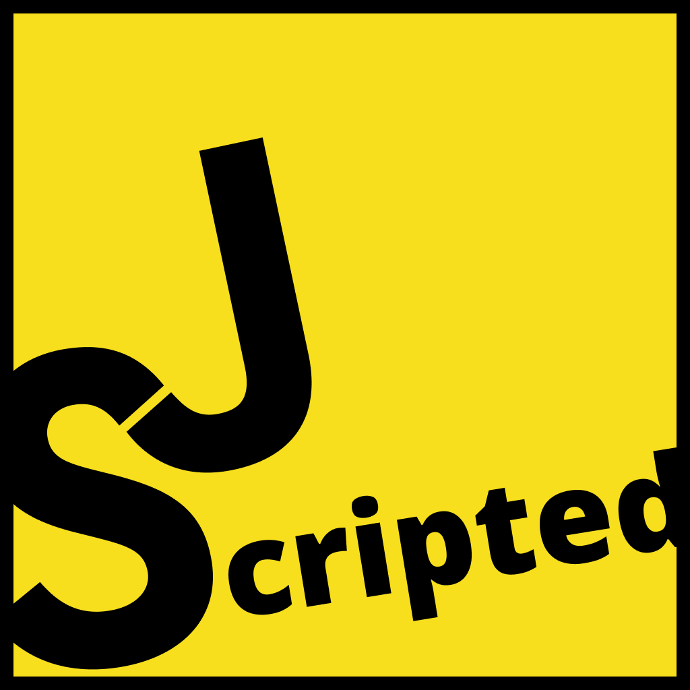

  

 <h1 align="center">JScripted</h1>
 
JavaScript simplified to the bare minimum for acing your Front End Interviews.

## Contributing
Pull requests are welcome. For major changes, please open an issue first to discuss what you would like to change.

Please make sure to update tests as appropriate.

## License
[MIT](https://choosealicense.com/licenses/mit/)
